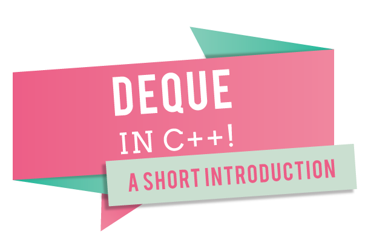
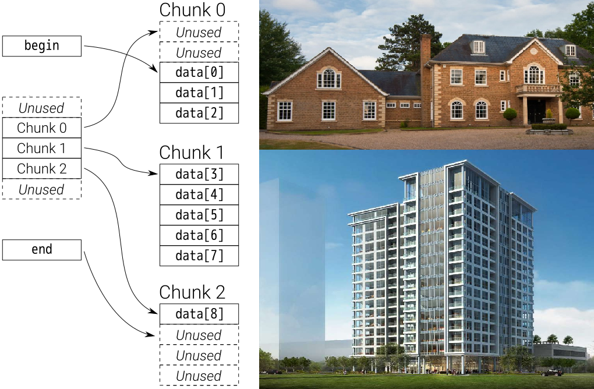

# Introduction to Deque in C++



**Acknowledgement:** *Everything written below is from my own experience in college and after reading various materials. I am neither a professional nor expert, but a student who has great passion for the language. Anyone can open a discussion in the issue section, or a pull request in case something should be modified or added. If you consider my work valuable, a [donation](#donation) is much appreciated.*  

> Also, I highly recommend you read vector before this if you are new to C++ STL containers.

## Table of contents:  
1. [What is deque in C++](#id-section1)  
2. [Deque vs Vector](#id-section2)
3. [How do we use Deque](#ud-section3)
4. [Operations on Deque](#id-section4)


<div id="id-section1"/>  
## What is deque in C++  

**Deque** ( pronounced the same as "deck"), is an abbreviation of **double-ended queue** . It is categorized as a sequence container along side with vector, array, list... Actually, **Deque** is a upgraded version of dynamic array, which can be expanded or contracted on both ends.  


<div id="id-section2"/>
## Deque vs Vector

In many cases, deque's behaviour and functionality is simillar to [vector](vector.md)'s. They all manage to hold multiple data elements, automatically handle storage, provide direct random access...  The only operations supplied by vector that deque doesn't have are capacity() and reserve() ( as deque doesnt need this :smile:). However, deep inside, they are very different :   

* **Deque** is born for **insertion and deletion at both ends** (as its name suggests).    

_Of course, there are methods to imitate this on a vector but it is just not suitable for that as nobody ever uses a knife to cut wood instead of a saw or an axe. Deque is more effficient. On the other hand, vector excels at accessing and moving through elements. ( Think of this comparison as a two-way street vs a one-way street ). Also, with operations at other positions rather than the beginning and the end, deque performs worse than vector._  

* **Deque** doesn't store data in **contiguous storage locations**. This is **important**.  

_While vector uses a single block of memory to store the data, deque utilizes (many) different blocks of memory. They scattered their data, but still mantain a way of direct access. Therefore, normal pointers don't work well with deque due to the need of jumping between memory blocks (*Iterators are smart pointers, thus recommended*). Internally, this is considered to be more complex than vector but it allows more efficient growth under certain circumstances._    

```A real life example of this behaviour is the housing problem. Computer memory is devided into blocks, of which expansion is hard individually but easy when combined together. Likewise, instead of expanding the area of a house for more people to reside, the humanity came up with the idea of skyscrappers, tall buildings, apartments,... ```

  

* Blocks of memory can get freed when using **Deque** but not with **Vector**.  

_As deleting an element in vector still rooms the space inside the *capacity*._ 

###### You shall decide which to use depending on your situation.  

<div id="id-section3"/>

## How do we use deque  

It is very simmilar to vector. The only difference is in the keyword.  
Please read back the [Vector](vector.md) guide. 

```c++
deque<int> A;   // default constructor, construct a deque without elements inside.
```

<div id="id-section4"/>
## Operations on deques

As mentioned above, deques are very similar to vectors. Therefore, the operations on both containers are almost indentical, with small specific differences : 
- Deques do not provide the functions for capacity (capacity() and reserve()). 
- Deques do provide direct functions to insert and to delete the first element (push_front() and pop_front()). 

Please read back the [Vector](vector.md) guide. Here is a neat table including most ( not all ) crucial operations on deque :  

| Operations                  | Result                                                                                             |
|-----------------------------|----------------------------------------------------------------------------------------------------|
| a.empty()                   | Return whether the dequeue is empty or not.                                                        |
| a.size()                    | Return the number of elements inside.                                                              |
| a.front()                   | Return an element at the front                                                                     |
| a.back()                    | Return an element at the back                                                                      |
| a.begin()                   | Return iterator at the begin                                                                       |
| a.end()                     | Return iterator at the end                                                                         |
| swap(a,b) | a.swap(b)       | swap two deques                                                                                    |
| a.push_back(element)        | Push an element at the back                                                                        |
| a.pop_back()                | Pop the element at the back                                                                        |
| a.push_front(element)       | Push an element at the front                                                                       |
| a.pop_front(element)        | Pop the element at the front                                                                       |
| a.insert(position, element) | Insert an element at a position. (position is an iterator)                                         |
| a.clear()                   | Removes all elements from the deque (which are destroyed), leaving the container with a size of 0. |
| a.erase(pos)                | Remove a single element at a position. (pos is an iterator).                                       |
| a.erase(start, end)         | Remove a bunch of elements in a range. ( start, end are iterators).                                |
| a.max_size()                | Return the maximum number of elements that a deque can hold                                        |
| a.shrink_to_fit()           | Requests the container to reduce its memory usage to fit its size.                                 |
| a.resize()                  | Resize the deque ( by adding or destroying elements)                                               |


Because push_front and pop_front is unique to deque, let us take an example to see how it works. 

* push_front  

```cpp
#include <iostream>
#include <deque>
using namespace std;

int main()
{
    deque<char> myDeque;
    // create deque
    for(int i = 0 ; i<4; i++) {
        myDeque.push_back('B'+i ) ; // B C D E
    }

    // insert A into the head of deque
    myDeque.push_front('A');

    // print deque
    deque<char>::iterator it;
    for( it =myDeque.begin()  ; it!=myDeque.end(); it++) {
       cout<<*it<<" " ;
    }
    return 0;

    // this code outputs : A B C D E
}
```

* pop_front  

```cpp
#include <iostream>
#include <deque>
using namespace std;

int main()
{
    deque<char> myDeque;
    // create deque
    for(int i = 0 ; i<5; i++) {
        myDeque.push_back('a'+i ) ; // a b c d e
    }

    // remove a out of deque
    myDeque.pop_front();
    // print deque
    deque<char>::iterator it;
    for( it=myDeque.begin()  ; it!=myDeque.end(); it++) {
       cout<<*it<<" " ;
    }

    return 0;
    // this code outputs : b c d e 
}
```
----------
### This is the end! :smiley: HAVE FUN WITH DEQUES!
<div id='donation'/>
[](https://www.paypal.com/cgi-bin/webscr?cmd=_s-xclick&hosted_button_id=5ZG5Z47L2ZGYC)
A beer in your country can buy a meal in mine.

