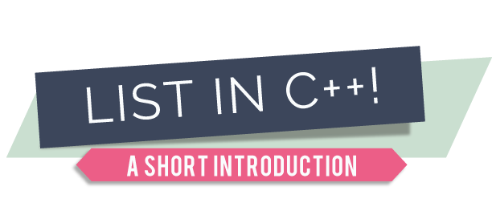

# Introduction to Deque in C++



**Acknowledgement:** *Everything written below is from my own experience in college and after reading various materials. I am neither a professional nor expert, but a student who has great passion for the language. Anyone can open a discussion in the issue section, or a pull request in case something should be modified or added. If you consider my work valuable, a [donation](#donation) is much appreciated.* 

> Also, I highly recommend you read vector before this if you are new to C++ STL containers.


## Table of Contents: 
1. [What is a linked list](#what-is-a-linked-list)
2. [List container in C++ STL](#list-container-in-c-stl)
3. [How do we use list](#how-do-we-use-list)
4. [Operations on list](#operations-on-list)

## What is a linked list

C++ and many other languages support a sequence of data structures called **linked list**.  

**Linked list**, as its name suggests, is a **list** of data that is kept **linked** together. Basically, **linked list** and **array** are similar since they both store collections of data, but they differ a lot from their core and they exist to make up for each other's drawbacks.   

_While **array** is one of the most **convenient** and **popular** way to store and access data, programmers in the early days (when memory is expensive and limited) witnessed its disadvantages in allocation and dynamic behaviours, hence the birth of **linked list**._  

Comparing to **array**, **linked list** wins as:   

* Storing huge size of data doesn't require expensive allocation.
* Data can be kept on different blocks of memory.
* No initial size value should be defined.
* The size of a linked list is never fixed.

and loses when:  

* Accessing random elements ( there is no indices in linked list ).
* Inserting or removing elements at the front or in the middle.
* Storing very small data ( for instance : characters, boolean values).  

With C++, **pointers** are utilized to keep the **list** *linked*. Here is how **linked lists** usually look in real life:  
```cpp
struct Node {
	int data;			 // data we need to store.
	Node* next;          // this is a pointer that points to another node.
} 

void insertFront (Node *head, int n) {      // this function inserts a node at the front 
	Node *newNode = new Node;
	newNode->data = n;
	newNode->next = head;   // link the new node to the head
	head = newNode;        // since head is no longer 1, we need to update it
}

int main() {
	Node* head = new Node;   // the first node of the list is often named "head"
	head->data = 1;
	head->next = NULL;    // this list has 1 element
	insertFront(head, 2);  // insert 2 at the front
}
```

Actually, there are 3 flavours of list that is popular these days : 

* Original Linked List - one way navigation : forward.
* Doubly Linked List - two way navigation : forward and backward.
* Circular Linked List - round navigation : last node linked to first node.

Basic understanding of **linked list** concept is crucial to start learning **list** container in C++ STL. If you wish to know more about **linked list** itself, you should search for more other materials.

## List container in C++ STL 

A **list** container manages its element the same way as a **doubly linked list**. 

----------
### This is the end! :smiley: HAVE FUN WITH LISTS!
<div id='donation'/>
[](https://www.paypal.com/cgi-bin/webscr?cmd=_s-xclick&hosted_button_id=5ZG5Z47L2ZGYC)
A beer in your country can buy a meal in mine.
